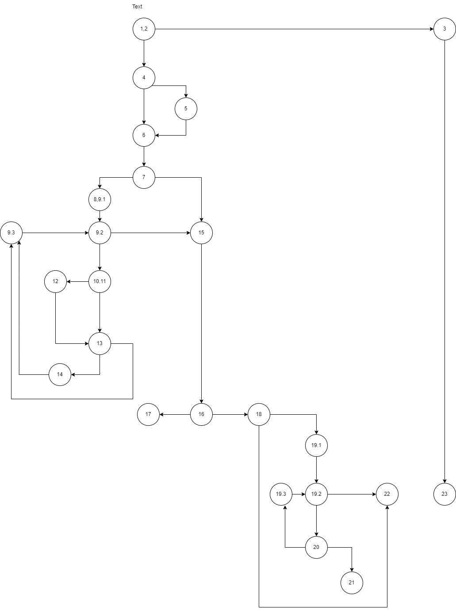

# SI_2023_lab2_216116
Изабела Андоновска 216116

CONTROL FLOW GRAPH
--

ЦИКЛОМАТСКА КОМПЛЕКСНОСТ
--
Цикломатската комплексност на кодот е 11 истата ја добив со броење на региони и броење на предикатни јазли P+1 каде P-предикатен јазол

ТЕСТ СЛУЧАИ СПОРЕД КРИТЕРИУМОТ EVERY STATEMENT
--
Every statement ќе се измине со најмалку 4 тест случаи
првиот тест случај е тој што ќе фрли exception input user = null  останатите инпути не се битни
вториот тест случај е input (userName = null password=bella email=andonovskaizabela@gmail.com <list of users>= во листата да има корисник со ист емаил и ист userName
  така ги покриваме иф условите до 17 statement каде што враќа false
третиот тест пример input(userName= Izabela password= password*+, email= andonovskaizabela@gmail.com <list of users> овде влегуваме во ифот каде во емаилот има специјални карактери и програмата завршува на 21 statement
затоа ни треба уште еден тест примет за да отиде до крај а тоа е четвртиот тест пример userName= Izabela password= password123, email= andonovskaizabela@gmail.com <list of users>

ТЕСТ СЛУЧАИ СПОРЕД КРИТЕРИУМОТ EVERY PATH
--

